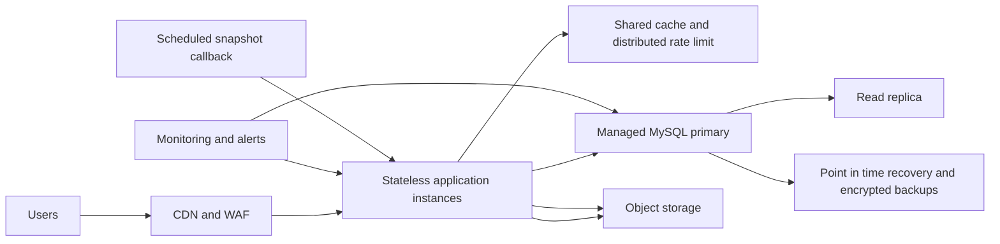

# 50,000 User Readiness Plan

## Objective and Boundary

This document prepares the Mantis portfolio application for growth toward **50,000 registered users** and for traffic spikes without making an unsupported claim of zero downtime or zero data loss. Those outcomes depend on measured capacity, managed database recovery guarantees, edge protection, deployment configuration, and operating discipline. The implemented changes reduce current request pressure and establish a recovery path; the required production controls below complete the target architecture.

## Current Application Assessment

| Area | Current observation | Readiness action |
| --- | --- | --- |
| Public content | The portfolio is mostly static, but the public project list was fetched from the database on each active process. | A bounded 60-second in-process cache now reduces repeated database reads and is invalidated after project writes. |
| Authentication | The request context attempted authentication for all tRPC traffic, including anonymous visitors. Authenticated requests also wrote `lastSignedIn` every time. | Anonymous traffic now skips authentication work, and routine authenticated requests no longer perform a database write. |
| Asset delivery | Every storage redirect previously requested a new signed URL and returned `no-store`. | The redirect layer now has a bounded cache and cache headers, while hashed built assets are immutable-cached. |
| Runtime availability | No liveness, readiness, or drain behavior was available. | `/healthz`, `/readyz`, trust-proxy, graceful SIGTERM/SIGINT draining, and a lower 1 MB request payload limit are now in place. |
| Data recovery | The managed database had no application-level export ledger. | Versioned project-configuration snapshots can now be written to object storage, checksummed, and indexed in `recoverySnapshots`; managed database backups remain responsible for user-account recovery. |
| Client request behavior | Query defaults had no explicit stale-time or bounded retry policy. | The client now uses a 60-second freshness window, avoids refetch-on-focus, and uses capped exponential retries with jitter for transient failures. |

## Target Production Architecture

The application tier must remain stateless. Session verification, public pages, project reads, and storage redirects must not rely on local process memory for correctness. The local caches added in this revision are deliberately optimization-only: stale or empty cache state still falls back to MySQL or object storage.

For high-scale production traffic, place a CDN and WAF before the app. Cache hashed static assets for one year, cache public HTML according to release needs, enforce bot management and distributed rate limits at the edge, and serve the portfolio image assets from object storage through a CDN. The application should set a maximum-instance limit that is calculated from database connection capacity, not from cost preference alone. Cloud Run uses concurrency and CPU to scale stateless services, and its own guidance warns that backing services must be sized for the instances that can scale out.[1]

The current WebDev autoscale environment is suitable for the current application and its low-write portfolio workflow, but it has a 5-pod, 1 vCPU, 512 MB per-pod ceiling. A workload requiring 50,000 simultaneous dynamic users must be load-tested against that ceiling. If load testing shows that the target cannot be met, retain this codebase but move the runtime and database tiers to a higher-capacity managed environment with multi-zone application instances, a managed MySQL high-availability configuration, a shared Redis-compatible cache, and a global CDN/WAF.

## Reliability Targets

| Service | Target | Measurement | Action when breached |
| --- | --- | --- | --- |
| Public page availability | 99.95% monthly | Synthetic `GET /healthz` and public-page checks | Freeze non-critical releases, investigate edge, app, and storage errors. |
| Readiness | 99.95% monthly | `GET /readyz` success ratio | Remove unhealthy instances; investigate MySQL availability and connection saturation. |
| Public API latency | p95 under 300 ms | Edge and application latency telemetry | Reduce concurrency, add cache capacity, or scale the database read path. |
| Admin mutation errors | below 0.1% | tRPC mutation result telemetry | Pause release activity and inspect validation, database, and storage errors. |
| Recovery point objective | 15 minutes maximum after production activation | Successful snapshot and provider backup records | Alert after one missed snapshot; execute recovery drill quarterly. |
| Recovery time objective | 60 minutes maximum | Timed restore drills in a clean environment | Update the runbook and infrastructure if the target is missed. |

Use service-level objectives and an error budget to gate release velocity. Google SRE recommends progressive rollouts, monitored rollback triggers, load-tested capacity planning, and bounded overload handling rather than uncontrolled retries.[2]

## Data Protection and Recovery

The `recoverySnapshots` implementation produces a versioned JSON envelope containing public project configuration only, computes a SHA-256 checksum, uploads the payload to object storage, and records the object key, checksum, record count, and creation time. User-account records are intentionally excluded from this object-storage snapshot so personal account data remains protected by the managed database backup and point-in-time recovery controls. The design is safe for repeated execution and does not replace a managed database's point-in-time recovery.

Before scheduling automated snapshots, publish this checkpoint. After publish, create a project-level Heartbeat task that posts to `/api/scheduled/recoverySnapshot` every 15 minutes. The handler authenticates the platform cron identity and returns structured errors so failed attempts are visible in task history. Do not use process-local timers for backups because autoscaled instances are not persistent.[3]

The operational recovery procedure is as follows:

1. Declare an incident and stop write traffic at the edge or by disabling the admin route.
2. Identify the newest checksum-verified object snapshot and the provider point-in-time restore position.
3. Restore into an isolated database, compare record counts and checksum, then validate application reads with `/readyz` and synthetic public requests.
4. Promote only after application and data validation pass. Preserve the affected production database for forensic analysis.
5. Record the incident and update the recovery drill evidence.

## Required Production Configuration

| Control | Required state before a 50,000-user launch |
| --- | --- |
| Database | Managed MySQL with automated backups, point-in-time recovery, multi-zone failover, encryption at rest, TLS in transit, connection limits, and restore testing. |
| Cache and rate limiting | Shared Redis-compatible cache and distributed edge/API rate limits. Do not treat the application's local cache as a shared correctness layer. |
| Edge | CDN, WAF, DDoS mitigation, bot controls, rate limits, TLS, origin-only access, and access logs. |
| Runtime | At least two application failure domains, minimum warm capacity sized from load testing, a database-safe maximum-instance setting, and controlled concurrency. |
| Observability | Request count, p50/p95/p99 latency, 4xx/5xx rate, saturation, database connections, storage failures, snapshot age, deployment version, and synthetic health checks. |
| Delivery | Staging environment, schema expand-contract migrations, canary rollout, monitored rollback, and documented feature flags. |
| Security | Secret rotation, least-privilege database credentials, admin MFA through the identity provider, audit logging, dependency scanning, and vulnerability patch cadence. |

## Load-Test Acceptance Plan

Execute tests only in a staging environment with production-like database and edge configuration. Start with 100 requests per second of anonymous public traffic, then increase stepwise until p95 latency, error rate, or database saturation breaches the targets. Include a sudden burst test, a sustained 60-minute soak test, asset-heavy page loads, authenticated admin operations, and database failover simulation.

Pass criteria are: no data corruption, no uncontrolled retry storm, liveness and readiness remain truthful, application instances recover through a rolling deployment, snapshot data restores with matching checksum and record count, and the agreed SLOs remain within target. Size the runtime from measured requests per second and database connection consumption, not a registered-user count alone.

## Implemented Files

| File | Purpose |
| --- | --- |
| `shared/scalePolicy.ts` | Shared bounded cache and payload policy. |
| `server/db.ts` | Public project cache with write invalidation and transactional project reordering. |
| `server/recoverySnapshot.ts` | Checksum-backed snapshot generation, storage upload, metadata listing, and cron callback. |
| `server/_core/index.ts` | Health endpoints, readiness check, graceful draining, smaller body limit, and scheduled snapshot route. |
| `server/_core/storageProxy.ts` | Bounded signed-redirect cache and cache headers. |
| `server/_core/vite.ts` | Immutable asset caching and dynamic document cache protection. |
| `client/src/main.tsx` | Bounded retry, jitter, stale time, and reduced refetch behavior. |

## References

[1] [Google Cloud: About instance autoscaling in Cloud Run services](https://docs.cloud.google.com/run/docs/about-instance-autoscaling)

[2] [Google SRE: A Collection of Best Practices for Production Services](https://sre.google/sre-book/service-best-practices/)

[3] [Manus: Periodic Updates Reference](../skills/webdev-periodic-updates/SKILL.md)
